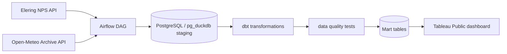

# Ilma mõju elektrihinnale

## Äriküsimus

Projekti käigus analüüsime, kuidas ilmastikutegurid — temperatuur, tuulekiirus, päikesekiirgus ja pilvisus — on seotud Eesti ja lähiriikide elektri börsihinnaga. 
Tulemusi saavad kasutada andmeanalüütikud või energiahuvilised, et mõista, millistel ilmastiku- ja ajatingimustel on elektrihind kõrgem või madalam.

**Mõõdikud:**

1. Keskmine elektrihind riigi ja päeva lõikes
2. Elektrihinna seos ilmaandmetega: temperatuur, tuulekiirus, päikesekiirgus ja pilvisus
3. Keskmine hind ilma kategooriate lõikes, näiteks `temperature_category`, `wind_category`, `solar_category`, `cloud_category`

Täpsem kirjeldus: [`docs/arhitektuur.md`](docs/arhitektuur.md)

## Arhitektuur



Täpsem kirjeldus: [`docs/arhitektuur.md`](docs/arhitektuur.md)

## Andmestik

| Allikas | Tüüp | Ajas muutuv? | Roll |
|---------|------|--------------|------|
| Elering NPS API | API | Jah, elektrihinnad uuenevad ajas | Põhiandmevoog elektri börsihindade jaoks |
| Open-Meteo Archive API | API | Jah, ajaloolised ilmaandmed täienevad ajas | Põhiandmevoog ilmaandmete jaoks |

Projekt kasutab tunnipõhiseid andmeid. Iga päeva kohta oodatakse nelja riigi andmeid:

- Eesti, `EE`
- Soome, `FI`
- Läti, `LV`
- Leedu, `LT`

Tunnipõhise andmestiku puhul on ühe täispäeva oodatav ridade arv ühe tabeli kohta:

```text
4 riiki × 24 tundi = 96 rida
```

## Stack

| Komponent | Tööriist |
|-----------|---------|
| Sissevõtt | Apache Airflow + Python |
| Transformatsioon | dbt Core |
| Andmehoidla | PostgreSQL + pg_duckdb |
| Näidikulaud | Tableau Public |
| Orkestreerimine | Apache Airflow |
| Konteinerkeskkond | Docker Compose |

## Käivitamine

### 1. Klooni repo ja liigu projekti kausta

```bash
git clone https://github.com/annniq/energy-weather-pipeline-v1.git
cd energy-weather-pipeline-v1
```

### 2. Loo `.env` fail

```bash
cp .env.example .env
```

Seejärel ava `.env` fail ja täida paroolid ning Airflow salajased võtmed.

### 3. Genereeri Airflow võtmed

Fernet key:

```bash
python3 -c "from cryptography.fernet import Fernet; print(Fernet.generate_key().decode())"
```

JWT secret:

```bash
openssl rand -hex 32
```

Lisa saadud väärtused `.env` faili:

```env
AIRFLOW__CORE__FERNET_KEY=<genereeritud_fernet_key>
AIRFLOW__API_AUTH__JWT_SECRET=<genereeritud_jwt_secret>
```


### 4. Käivita teenused

```bash
docker compose up -d --build
```

### 5. Ava Airflow

Airflow UI:

```text
http://localhost:8080
```

Kasutaja ja parool tulevad `.env` failist:

```env
AIRFLOW_USER=<user>
AIRFLOW_PASSWORD=<pw>
```

Andmebaas on host-masinast kättesaadav:

```text
Host: localhost
Port: 5433
Database: energy_weather
User: <user>
Password: <pw>
```

Dockeri konteinerite seest kasutatakse andmebaasi hostina:

```text
analytics-db:5432
```

## DAG-i käsitsi käivitamine

Airflow DAG-i nimi on:

```text
energy_weather_pipeline
```

DAG käivitub automaatselt iga päev kell `00:30 UTC`.

DAG laadib vaikimisi eelmise päeva andmed. Käsitsi saab kindla kuupäeva laadida nii:

```bash
docker compose exec airflow-apiserver airflow dags trigger energy_weather_pipeline \
  --conf '{"target_date": "2025-05-21"}'
```

## dbt käsitsi käivitamine

Airflow DAG käivitab dbt automaatselt pärast Eleringi ja Open-Meteo andmete laadimist.

Soovi korral saab dbt käsitsi käivitada Airflow konteineris:

```bash
docker compose exec airflow-scheduler /opt/airflow/dbt_venv/bin/dbt build \
  --no-partial-parse \
  --project-dir /opt/airflow/dbt \
  --profiles-dir /opt/airflow/dbt
```

dbt ühendust saab kontrollida:

```bash
docker compose exec airflow-scheduler /opt/airflow/dbt_venv/bin/dbt debug \
  --project-dir /opt/airflow/dbt \
  --profiles-dir /opt/airflow/dbt
```
Täpsem kirjeldus: [`docs/dbt.md`](docs/dbt.md)

## Saladused ja konfiguratsioon

Kõik paroolid ja võtmed on `.env` failis. Repos on ainult `.env.example`, mis näitab vajalike muutujate struktuuri. 

Vajalikud muutujad:

| Muutuja | Tähendus | Näide |
|---------|----------|-------|
| `AIRFLOW_UID` | Airflow konteineri kasutaja ID | `50000` |
| `POSTGRES_USER` | Analüütikaandmebaasi kasutaja | `energy` |
| `POSTGRES_PASSWORD` | Analüütikaandmebaasi parool | `(saladus)` |
| `POSTGRES_DB` | Analüütikaandmebaasi nimi | `energy_weather` |
| `AIRFLOW_USER` | Airflow metadata andmebaasi ja UI kasutaja | `airflow` |
| `AIRFLOW_PASSWORD` | Airflow metadata andmebaasi ja UI parool | `(saladus)` |
| `AIRFLOW_DB` | Airflow metadata andmebaasi nimi | `airflow` |
| `AIRFLOW__CORE__FERNET_KEY` | Airflow ühenduste krüpteerimiseks vajalik võti | `(saladus)` |
| `AIRFLOW__API_AUTH__JWT_SECRET` | Airflow API autentimise salajane võti | `(saladus)` |

Fernet võtme saab luua näiteks nii:

```bash
python3 -c "from cryptography.fernet import Fernet; print(Fernet.generate_key().decode())"
```

JWT võtme saab luua näiteks nii:

```bash
openssl rand -hex 32
```

## Andmevoog lühidalt

1. **Sissevõtt** — Airflow DAG küsib Elering NPS API-st elektrihinna andmed ja Open-Meteo Archive API-st ilmaandmed.
2. **Laadimine** — Andmed laaditakse PostgreSQL/pg_duckdb `staging` skeemi tabelitesse:
   - `staging.elering_prices`
   - `staging.open_meteo_weather`
3. **Transformatsioon** — dbt ühendab elektrihinna ja ilmaandmed tunnipõhiseks analüüsitabeliks ning loob mart-kihi tabelid.
4. **Testimine** — dbt testid kontrollivad andmekvaliteeti, näiteks null-väärtuseid, lubatud riigikoode, unikaalsust ja väärtuste vahemikke.
5. **Näidikulaud** — Dashboard ehitatakse mart-kihi tabelite peale. Peamised tabelid on:
   - `marts.fct_energy_weather_hourly`
   - `marts.mart_energy_weather_daily`
   - `marts.mart_energy_weather_by_condition`

## Andmebaasi tabelid ja mudelid

### Staging

| Tabel | Kirjeldus |
|------|-----------|
| `staging.elering_prices` | Tunnipõhised elektrihinnad Elering NPS API-st |
| `staging.open_meteo_weather` | Tunnipõhised ilmaandmed Open-Meteo Archive API-st |

### Intermediate

| Mudel | Kirjeldus |
|------|-----------|
| `intermediate.int_energy_weather_hourly` | Ühendatud tunnipõhine elektrihinna ja ilmaandmete vaade |

### Marts

| Mudel | Kirjeldus |
|------|-----------|
| `marts.fct_energy_weather_hourly` | Tunnipõhine faktitabel dashboardi ja analüüsi jaoks |
| `marts.mart_energy_weather_daily` | Päeva ja riigi tasemel kokkuvõte |
| `marts.mart_energy_weather_by_condition` | Kokkuvõte ilma- ja ajakategooriate lõikes |

## Peamised väljad

| Väli | Kirjeldus |
|------|-----------|
| `country_code` | Riigikood: `EE`, `FI`, `LV`, `LT` |
| `timestamp_utc` | Tunnipõhine UTC ajatempel |
| `price_eur_mwh` | Elektrihind eurodes megavatt-tunni kohta |
| `temperature_2m_c` | Temperatuur 2 m kõrgusel, °C |
| `wind_speed_10m_kmh` | Tuulekiirus 10 m kõrgusel, km/h |
| `shortwave_radiation` | Päikesekiirgus |
| `cloud_cover` | Pilvisus protsentides |
| `temperature_category` | Temperatuuri kategooria |
| `wind_category` | Tuule kategooria |
| `solar_category` | Päikesekiirguse kategooria |
| `cloud_category` | Pilvisuse kategooria |
| `time_category` | Kellaaja kategooria, näiteks `Night`, `Morning Peak`, `Day`, `Evening Peak` |
| `is_daylight_hour` | Tõeväärtus, kas tunnil oli päikesekiirgust |

## Andmekvaliteedi testid

Projekt kontrollib järgmist:

1. **Not null testid** — olulised väljad ei tohi olla tühjad, näiteks `country_code`, `timestamp_utc`, `price_eur_mwh`, `temperature_2m_c`.
2. **Lubatud väärtuste testid** — riigikoodid peavad olema ainult `EE`, `FI`, `LV`, `LT`.
3. **Unikaalsuse test** — faktitabelis ei tohi olla korduvaid ridu sama `country_code` ja `timestamp_utc` kombinatsiooni kohta.
4. **Väärtuste vahemiku testid** — kontrollitakse füüsikalisi ja ärilisi piire:
   - elektrihind peab jääma vahemikku `-500` kuni `5000` €/MWh
   - temperatuur peab jääma vahemikku `-50` kuni `50` °C
   - tuulekiirus peab jääma vahemikku `0` kuni `125` km/h
   - päikesekiirgus ei tohi olla negatiivne
   - pilvisus peab jääma vahemikku `0` kuni `100`
5. **Oodatud tundide arv** — päevases mart-tabelis peab olema ühe riigi kohta 24 tunnipõhist vaatlust.

Teste saab käivitada koos dbt build käsuga:

```bash
docker compose exec airflow-scheduler /opt/airflow/dbt_venv/bin/dbt build \
  --no-partial-parse \
  --project-dir /opt/airflow/dbt \
  --profiles-dir /opt/airflow/dbt
```

## Kontrollpäringud

Laetud staging andmete kontroll:

```bash
docker compose exec analytics-db psql -U energy -d energy_weather -c "
SELECT 'elering_prices' AS table_name, price_date AS date_value, COUNT(*) AS rows
FROM staging.elering_prices
GROUP BY price_date

UNION ALL

SELECT 'open_meteo_weather' AS table_name, weather_date AS date_value, COUNT(*) AS rows
FROM staging.open_meteo_weather
GROUP BY weather_date

ORDER BY date_value, table_name;
"
```

Oodatud tulemus ühe täispäeva kohta:

```text
elering_prices      | kuupäev | 96
open_meteo_weather  | kuupäev | 96
```

Ühendatud andmestiku eelvaade:

```bash
docker compose exec analytics-db psql -U energy -d energy_weather -c "
SELECT
    p.price_date,
    p.country_code,
    p.timestamp_utc,
    p.price_eur_mwh,
    w.temperature_2m_c,
    w.wind_speed_10m_kmh,
    w.shortwave_radiation,
    w.cloud_cover
FROM staging.elering_prices p
JOIN staging.open_meteo_weather w
  ON p.country_code = w.country_code
 AND p.timestamp_utc = w.timestamp_utc
ORDER BY p.price_date, p.timestamp_utc, p.country_code
LIMIT 100;
"
```

Mart-tabelite kontroll:

```bash
docker compose exec analytics-db psql -U energy -d energy_weather -c "
SELECT table_schema, table_name
FROM information_schema.tables
WHERE table_schema IN ('intermediate', 'marts')
ORDER BY table_schema, table_name;
"
```

Käsk, millega saab kontrollida, et töövoog töötab:

```bash
docker compose exec airflow-scheduler airflow dags trigger energy_weather_pipeline
```

Oodatav tulemus ja näidikulaua testimine
Andmetorustiku käivitamine:
Pärast käsu käivitamist peaks terminalis kuvatav tabel näitama, et käsk töötas ja DAG läks edukalt käivitusjärjekorda (olekusse queued või running). 

Näidikulaud:

Näidikulaud on loodud Tableau Publicus. Dashboard kasutab dbt mart-kihi tabeleid.

Tableau Publicu dashboardide lingid:

* [General Trends - korrelatsioon](https://public.tableau.com/app/profile/anniq.k/viz/kodut_dash_v1/dash3)
* [Regional Comparison](https://public.tableau.com/app/profile/anniq.k/viz/kodut_dash_v1/dash2)
* [Weather and Price Timeline](https://public.tableau.com/app/profile/anniq.k/viz/kodut_dash_v1/dash1)


## Projekti struktuur

```text
.
├── README.md
├── compose.yml
├── Dockerfile.airflow
├── .env.example
├── .gitignore
├── dags/
│   └── energy_weather_pipeline.py
├── sql/
│   └── create_tables.sql
├── dbt/
│   ├── dbt_project.yml
│   ├── profiles.yml
│   ├── macros/
│   │   ├── drop_stale_dbt_backups.sql
│   │   └── generate_schema_name.sql
│   ├── models/
│   │   ├── sources.yml
│   │   ├── intermediate/
│   │   │   ├── int_energy_weather_hourly.sql
│   │   │   └── schema.yml
│   │   └── marts/
│   │       ├── fct_energy_weather_hourly.sql
│   │       ├── mart_energy_weather_daily.sql
│   │       ├── mart_energy_weather_by_condition.sql
│   │       └── schema.yml
│   └── tests/
│       ├── fct_energy_weather_hourly_unique.sql
│       ├── int_energy_weather_hourly.sql
│       └── mart_energy_weather_daily_expected_hours.sql
└── docs/
    ├── arhitektuur.md
    └── progress.md
```

## Riskid

| Risk | Mõju | Maandus |
|------|------|---------|
| API ei vasta või on ajutiselt maas | Airflow DAG ebaõnnestub ja uue päeva andmed ei jõua andmebaasi | Airflow taskidel on retry loogika; DAG-i saab hiljem uuesti käivitada |
| API vastuse struktuur muutub | Andmete laadimine võib katki minna, sest kood ootab kindlaid välju nagu `data` või `hourly` | Kood kontrollib vajalike väljade olemasolu ja annab vea korral selge veateate |
| Andmed jõuavad API-sse hilinemisega | Planeeritud käivitus võib laadida pooliku või puuduva päeva | Vajadusel käivitada DAG hiljem või käsitsi sama `target_date` väärtusega |
| Andmekvaliteedi probleemid | Dashboard ja analüüs võivad anda valesid tulemusi | dbt testid kontrollivad null-väärtuseid, lubatud väärtuseid, unikaalsust ja väärtuste vahemikke |
| Ajavööndi vead | Elektrihinna ja ilmaandmed ei liitu õigete timestampidega | Kõik ajatemplid salvestatakse UTC kujul ja ühendatakse `country_code + timestamp_utc` alusel |
| Duplikaatread korduskäivitamisel | Sama kuupäeva uuesti laadimisel võivad tekkida topeltread | Staging tabelites on primaarvõti `(country_code, timestamp_utc)` ja laadimisel kasutatakse `ON CONFLICT DO NOTHING` |
| Ilmastikutegurid ei ole ainsad elektrihinda mõjutavad muutujad | Elektri börsihinda mõjutavad lisaks ilmastikutingimustele ka elektritarbimise maht, elektrijaamade hooldus- ja remonditööd, energiaimpordi ja -ekspordi mahud, kütusehinnad ning geopoliitilised tegurid |Analüüsi ulatus piiratakse ilmastikutegurite ja elektrihinna vaheliste seoste uurimisega. Töö järeldustes rõhutatakse, et tulemusi tuleb tõlgendada koos teadmisega, et elektrihinda mõjutavad ka muud tegurid, mida käesolevas analüüsis ei käsitleta |
| Korrelatsioon ei tähenda põhjuslikkust | Dashboardis kasutatud korrelatsioonianalüüs näitab muutujate vahelisi seoseid, kuid ei tõesta otsest põhjus-tagajärg seost. Näiteks võib elektrihinda mõjutada samaaegselt mitu tegurit, mida analüüs ei hõlma |Tulemuste esitamisel kasutatakse sõnastusi „seos“, „korrelatsioon“ ja „seotud tegurid“ ning välditakse väiteid otsese mõju või põhjus-tagajärg seose kohta |

## Kokkuvõte, puudused ja võimalikud edasiarendused

**Kokkuvõte:**

- Projekt laeb Elering NPS API-st tunnipõhised elektrihinnad.
- Projekt laeb Open-Meteo Archive API-st tunnipõhised ilmaandmed.
- Andmed salvestatakse PostgreSQL/pg_duckdb `staging` kihti.
- dbt loob intermediate ja mart mudelid analüüsi ning dashboardi jaoks.
- dbt testid kontrollivad andmekvaliteeti.
- Airflow orkestreerib kogu töövoogu ja käivitab dbt pärast andmete laadimist.

**Puudused:**

- Hetkel kasutatakse ilmaandmeteks linnade koordinaate, mitte kogu riigi keskmist ilma?
- Analüüs näitab seoseid, kuid ei tõesta põhjuslikku mõju.
- Tableau Publicu tasuta litsents ei toeta otsest reaalaja-ühendust (Live Connection) privaatsete andmebaasidega.

**Mis edasi:**

- Automatiseerida andmete uuendamine Tableau’s, eksportides dbt marts-tabelite tulemused vahekihi kaudu automaatselt pilvefaili (nt CSV või Google Sheets). See tagaks näidikulaua igapäevase uuendamise ilma litsentsikuludeta; alternatiivina võiks kasutada Tableau litsentsilahendust.
- Lisada automaatne teavitus, kui DAG või dbt testid ebaõnnestuvad.
- Rakendada dashboardil rikkalikumat analüütikat, kasutades marts-kihis olemasolevaid lisamõõdikuid, näiteks erinevaid ilmanähtuste kategooriaid, ekstreemväärtusi ning päeva- ja öötundide hindu. Nende näitajate kaasamine võimaldaks teha täiendavaid võrdlusi ning tuvastada uusi seoseid.
- Edasise arendusena võiks marts-kihti lisada regressioonianalüüsi tulemusi koondava tabeli. Selle põhjal saaks veelgi laiendada dashboarde ning pakkuda kasutajatele täiendavaid analüüsi- ja võrdlusvõimalusi.
- Võtta kasutusele Fingrid Open Data API (Estlink kaablite tööolekuks) ja EU ETS CO₂ hinna API, et projekti mudelit edasi arendada ja analüüsi täpsustada.


## Meeskond

| Nimi | Roll |
|------|------|
|  Krista Killo | Andmeallika ja Airflow sissevõtu omanik |
| Andres Matsin / Annika Kaskma | dbt transformatsioonide omanik |
| Annika Kaskma | Andmekvaliteedi testide omanik |
| Annika Kaskma /  Inga Staršinova | Näidikulaua ja dokumentatsiooni omanik |
