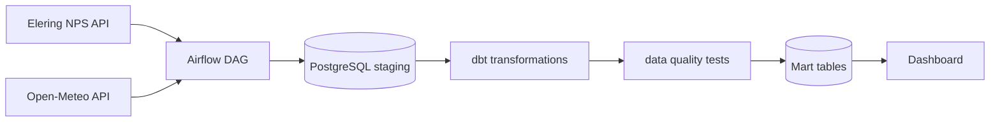

# Arhitektuur

## Äriküsimus

Kuidas mõjutavad ilmastikutegurid — temperatuur, tuulekiirus, pilvisus ja päikesekiirgus — Eesti, Läti, Leedu, Soome elektri börsihinda? 
Kas külmem ilm, väiksem tuul või madalam päikesekiirgus on seotud kõrgemate elektrihindadega ning millistel ilmastikuoludel ja aastaaegadel tekivad kõrgemad hinnad?
Täpsustame äriküsimuse ja mõõdikud teisipäevasel konsultatsioonil.

## Mõõdikud

1. **Kuidas iga ilmastikunähtus eraldi mõjutab hinda**  
   *(nt tuulekiirus, temperatuur, sademed ja pilvisus eraldi regressioonimuutujatena)*

   **Valem (kitsas mõttes):**

   ```text
   Hind_t = β0 + β1 * Tuul_t + β2 * Temp_t + β3 * Päikesekiirgus_t + β4 * Pilvisus_t + ε_t
   ```

   kus:
   - `Tuul_t` = tuulekiirus, m/s
   - `Temp_t` = temperatuur, °C
   - `Päikesekiirgus_t` = päikese kiirguse hulk, W/m²
   - `Pilvisus_t` = pilvisuse määr, %

---

2. **Kuidas ilmastikunähtuste kombinatsioonid mõjutavad hinda**  
   *(ehk ilmastikunäitajate koosmõjud/interaktsioonid, nt tugev tuul + madal temperatuur)*

   **Valem (interaktsioonidega):**

   ```text
   Hind_t =
     β0
     + β1 * (Tuul_t * Temp_t)
     + β2 * (Tuul_t * Päikesekiirgus_t)
     + β3 * (Temp_t * Päikesekiirgus_t)
     + β4 * (Tuul_t * Pilvisus_t)
     + ε_t
   ```

   võimalikud kombinatsioonid:
   - tugev tuul × madal temperatuur
   - tugev tuul × suur pilvisus
   - kõrge temperatuur × vähene päikesekiirgus
   - madal temperatuur × kõrge päikesekiirgus
---

3. **Kuidas aastaajad + ilmastikunähtused mõjutavad hinda**  
   *(hooajalisuse ja ilma koosmõju)*

   **Valem (hooajaliste dummy-muutujatega):**

   ```text
   Hind_t =
     β0
     + β1 * Suvi_t
     + β2 * Talv_t
     + β3 * Kevad_t
     + β4 * Sügis_t
     + β5 * (Talv_t * Tuul_t)
     + β6 * (Suvi_t * Temp_t)
     + β7 * (Sügis_t * Päikesekiirgus_t)
     + ε_t
   ```

   kus:
   - `Suvi_t`, `Talv_t`, `Kevad_t`, `Sügis_t` = hooajalised binaarsed muutujad, 0/1
   - mõõdetakse näiteks, kas tuule mõju hinnale on talvel tugevam kui suvel


Lisan uued alla:
-------------------------------------------------
## Core metrics:


## Average Price (kWh)

$$
\text{AvgPrice}_{c,p}^{kWh} = \frac{1}{1000} \cdot \text{AvgPrice}_{c,p}^{MWh}
$$

$$
\text{kus: } 
c \in \{EE, LV, LT, FI\} \text{ on riik}, \quad 
p \text{ on ajaperiood (nt päev, kuu või hooaeg), arvestades valitud filtreid}
$$


## Average Temperature

$$
\text{AvgTemp}_{c,p} = \frac{1}{N_{c,p}} \sum_{t \in (c,p)} \text{Temperature}_{c,t}
$$

$$
\text{kus: } 
c = \text{riik}, \quad 
p \text{ on ajaperiood (nt kuu), arvestades valitud filtreid}
$$


## Average Wind Speed

$$
\text{AvgWind}_{c,p} = \frac{1}{N_{c,p}} \sum_{t \in (c,p)} \text{WindSpeed}_{c,t}
$$

$$
\text{kus: } 
c = \text{riik}, \quad 
p \text{ on ajaperiood (nt kuu), arvestades valitud filtreid}
$$


## Average Solar Radiation

$$
\text{AvgSolar}_{c,p} = \frac{1}{N_{c,p}} \sum_{t \in (c,p)} \text{SolarRadiation}_{c,t}
$$

$$
\text{kus: } 
c = \text{riik}, \quad 
p \text{ on ajaperiood (nt kuu), arvestades valitud filtreid}
$$


## Average Cloud Cover

$$
\text{AvgCloud}_{c,p} = \frac{1}{N_{c,p}} \sum_{t \in (c,p)} \text{CloudCover}_{c,t}
$$

$$
\text{kus: } 
c = \text{riik}, \quad 
p \text{ on ajaperiood (nt kuu), arvestades valitud filtreid}
$$


## Märkus

Kõik näitajad arvutatakse sama riigi ja ajaperioodi lõikes, mis võimaldab võrrelda elektrihinna ja ilmastiku komponentide koosliikumist ajas.
``


   
## Andmeallikad

| Allikas | Tüüp | Ajas muutuv? | Roll |
|---------|------|--------------|------|
| Elering NPS API | API| Jah, iga päev 1h intervalliga | Kasutatakse elektrihindade eilsete andmete laadimiseks |
| Open-Meteo API | API |Jah, iga päev 1h intervalliga| Kasutatakse ilmastiku (tuul, temp, pilvisus, kiirgus) eilsete andmete laadimiseks |

## Andmevoog


> Täpsusta diagrammi vastavalt oma projektile — lisa rohkem andmeallikaid, mudeleid või teenuseid.

## Andmebaasi kihid

| Kiht | Roll |
|------|------|
| `staging` | Tabelid (raw) ehk API toorandmed JSON kujul|
| `intermediate` | Vaade | Skooriarvutus — ei salvestata, arvutatakse iga päringu korral |
| `marts` | Tabel | Äriloogika kokkuvõtted, mida Tableau loeb |

## Tööjaotus

| Roll | Vastutus | Täitja |
|------|----------|--------|
| Andmeallika omanik | Kirjutab sissevõtu loogika, hoiab API-t töös | Krista Killo |
| Transformatsioonide omanik | Kirjutab mart kihi mudelid ja mõõdikute arvutuse | Annika Kaskma / Andres Matsin |
| Kvaliteedi omanik | Kirjutab testid ja vaatab läbi ebaõnnestunud kontrollid | Andres Matsin |
| Näidikulaua omanik | Ehitab näidikulaua ja seob selle äriküsimusega | Annika Kaskma /  Inga Staršinova |

## Riskid

| Risk | Mõju | Maandus |
|------|------|---------|
| API ei vasta või andmed tulevad hiljem | Päeva andmed ei jõua õigel ajal andmebaasi | Airflow retry loogika, hilisem käsitsi või automaatne korduskäivitus |
| API vastuse struktuur muutub | DAG võib ebaõnnestuda, sest kood ootab kindlaid välju | Kontrollida vastuses vajalikke välju ja logida selged veateated |
| Andmekvaliteedi probleemid | Analüüs ja dashboard võivad näidata valesid tulemusi | dbt testid: `not_null`, ridade arv, lubatud riigikoodid ja väärtuste vahemikud |
| Ajavööndi vead | Elektrihinna ja ilmaandmed ei liitu õigete timestampidega | Kasutada kõikjal UTC timestampi ja kontrollida ridade vastavust joinis |

## Privaatsus ja turve

Isikuandmeid pole
Andmebaasi paroolid tulevad `.env` failist.
