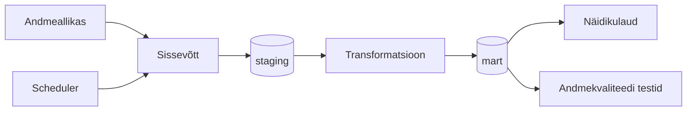

# Arhitektuur

## Äriküsimus

Kuidas mõjutavad ilmastikutegurid — temperatuur, tuulekiirus, pilvisus ja päikesekiirgus — Eesti, Läti, Leedu, Soome elektri ja CO2 börsihinda? 
Kas külmem ilm, väiksem tuul või madalam päikesekiirgus on seotud kõrgemate elektrihindadega ning millistel ilmastikuoludel tekivad kõrgemad hinnad?

## Mõõdikud

1. [Esimene mõõdik — kirjelda, mida arvutate ja kuidas]
2. [Teine mõõdik]
3. [Kolmas mõõdik — vabatahtlik]

## Andmeallikad

| Allikas | Tüüp | Ajas muutuv? | Roll |
|---------|------|--------------|------|
| [Elering NPS API] | [API] | Jah, [iga päev 15min intervalliga] | [Kasutatakse elektrihindade eilsete andmete pärimiseks |
| [Open-Meteo API] | [API] |Jah, [iga päev 15min intervalliga] | [Kasutatakse ilmastiku (tuul, temp, pilvisus, kiirgus) eilsete andmete pärimiseks.] |

## Andmevoog

> Täpsusta diagrammi vastavalt oma projektile — lisa rohkem andmeallikaid, mudeleid või teenuseid.

## Andmebaasi kihid

| Kiht | Roll |
|------|------|
| `staging` | Hoiab allika andmeid töötlemata kujul. |
| `mart` | Hoiab transformeeritud ja ärilogikat sisaldavaid tabeleid. |

## Tööjaotus

| Roll | Vastutus | Täitja |
|------|----------|--------|
| Andmeallika omanik | Kirjutab sissevõtu loogika, hoiab API-t töös | [Nimi] |
| Transformatsioonide omanik | Kirjutab mart kihi mudelid ja mõõdikute arvutuse | [Nimi] |
| Kvaliteedi omanik | Kirjutab testid ja vaatab läbi ebaõnnestunud kontrollid | [Nimi] |
| Näidikulaua omanik | Ehitab näidikulaua ja seob selle äriküsimusega | [Nimi] |

## Riskid

| Risk | Mõju | Maandus |
|------|------|---------|
| [Risk 1 — näiteks: API ei vasta] | [Mis juhtub?] | [Kuidas maandad?] |
| [Risk 2] | [Mis juhtub?] | [Kuidas maandad?] |
| [Risk 3] | [Mis juhtub?] | [Kuidas maandad?] |

## Privaatsus ja turve

[Kirjelda, millised isiku- või tundlikud andmed teie projektis esinevad (kui üldse) ja kuidas neid kaitsete. Isikuandmed peavad olema anonümiseeritud. Andmebaasi paroolid peavad tulema `.env` failist.]
