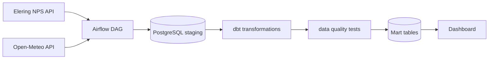

# Arhitektuur

## Äriküsimus

Kuidas mõjutavad ilmastikutegurid — temperatuur, tuulekiirus, pilvisus ja päikesekiirgus — Eesti, Läti, Leedu, Soome elektri ja CO2 börsihinda? 
Kas külmem ilm, väiksem tuul või madalam päikesekiirgus on seotud kõrgemate elektrihindadega ning millistel ilmastikuoludel tekivad kõrgemad hinnad?

## Mõõdikud

1. [Esimene mõõdik — kirjelda, mida arvutate ja kuidas]
2. [Teine mõõdik]
3. [Kolmas mõõdik — vabatahtlik]

## Andmeallikad

| Allikas | Tüüp | Ajas muutuv? | Roll |
|---------|------|--------------|------|
| Elering NPS API | API| Jah, iga päev 15min intervalliga | Kasutatakse elektrihindade eilsete andmete laadimiseks |
| Open-Meteo API | API |Jah, iga päev 15min intervalliga| Kasutatakse ilmastiku (tuul, temp, pilvisus, kiirgus) eilsete andmete laadimiseks |

## Andmevoog

> Täpsusta diagrammi vastavalt oma projektile — lisa rohkem andmeallikaid, mudeleid või teenuseid.

## Andmebaasi kihid

| Kiht | Roll |
|------|------|
| `staging` | Tabelid (raw) ehk API toorandmed JSON kujul ja nende puhastatud CSV-d  |
| `intermediate` | Vaade | Skooriarvutus — ei salvestata, arvutatakse iga päringu korral |
| `marts` | Tabel | Äriloogika kokkuvõtted, mida Superset loeb |

## Tööjaotus

| Roll | Vastutus | Täitja |
|------|----------|--------|
| Andmeallika omanik | Kirjutab sissevõtu loogika, hoiab API-t töös | Krista Killo |
| Transformatsioonide omanik | Kirjutab mart kihi mudelid ja mõõdikute arvutuse | Annika Kaskma / Andres Matsin |
| Kvaliteedi omanik | Kirjutab testid ja vaatab läbi ebaõnnestunud kontrollid | Annika Kaskma / Andres Matsin |
| Näidikulaua omanik | Ehitab näidikulaua ja seob selle äriküsimusega |  Inga Staršinova |

## Riskid

| Risk | Mõju | Maandus |
|------|------|---------|
| API ei vasta või andmed tulevad hiljem | Päeva andmed ei jõua õigel ajal andmebaasi | Airflow retry loogika, hilisem käsitsi või automaatne korduskäivitus |
| API vastuse struktuur muutub | DAG võib ebaõnnestuda, sest kood ootab kindlaid välju | Kontrollida vastuses vajalikke välju ja logida selged veateated |
| Andmekvaliteedi probleemid | Analüüs ja dashboard võivad näidata valesid tulemusi | dbt testid: `not_null`, ridade arv, lubatud riigikoodid ja väärtuste vahemikud |
| Ajavööndi vead | Elektrihinna ja ilmaandmed ei liitu õigete timestampidega | Kasutada kõikjal UTC timestampi ja kontrollida ridade vastavust joinis |

## Privaatsus ja turve

[Kirjelda, millised isiku- või tundlikud andmed teie projektis esinevad (kui üldse) ja kuidas neid kaitsete. Isikuandmed peavad olema anonümiseeritud. Andmebaasi paroolid peavad tulema `.env` failist.]
