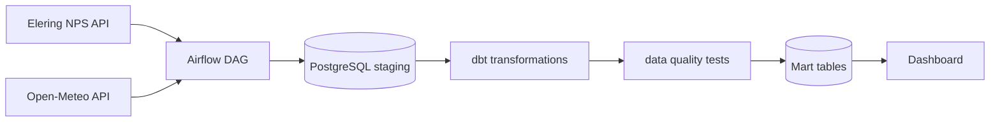

# Arhitektuur

## Äriküsimus

Kuidas mõjutavad ilmastikutegurid — temperatuur, tuulekiirus, pilvisus ja päikesekiirgus — Eesti, Läti, Leedu, Soome elektri börsihinda? 
Kas külmem ilm, väiksem tuul või madalam päikesekiirgus on seotud kõrgemate elektrihindadega ning millistel ilmastikuoludel ja aastaaegadel tekivad kõrgemad hinnad?
Täpsustame äriküsimuse ja mõõdikud teisipäevasel konsultatsioonil.

## Mõõdikud

## Põhimõõdikud / Core metrics:

Kõik näitajad arvutatakse sama riigi ja ajaperioodi lõikes, mis võimaldab võrrelda elektrihinna ja ilmastiku komponentide koosliikumist ajas.

## Average Electricity Price (EUR/kWh)

$$
\text{AvgPrice}_{c,p}^{kWh} = \frac{1}{1000} \cdot \text{AvgPrice}_{c,p}^{MWh}
$$

## Average Temperature

$$
\text{AvgTemp}_{c,p} = \text{average temperature riigis } c \text{ ajaperioodil } p
$$

## Average Wind Speed

$$
\text{AvgWind}_{c,p} = \text{average wind speed riigis } c \text{ ajaperioodil } p
$$

## Average Solar Radiation

$$
\text{AvgSolar}_{c,p} = \text{average solar radiation riigis } c \text{ ajaperioodil } p
$$

## Average Cloud Cover

$$
\text{AvgCloud}_{c,p} = \text{average cloud cover riigis } c \text{ ajaperioodil } p
$$

---
---
## Weather Impact Score

$$
\begin{aligned}
\text{WeatherImpact}_{c,p} =
& \ \alpha_1 \cdot (-\text{AvgTemp}_{c,p}) \\
& + \alpha_2 \cdot (-\text{AvgWind}_{c,p}) \\
& + \alpha_3 \cdot (-\text{AvgSolar}_{c,p}) \\
& + \alpha_4 \cdot \text{AvgCloud}_{c,p}
\end{aligned}
$$

$$
\begin{aligned}
\text{kus: } \\
c &\in \{EE, LV, LT, FI\} \text{ on riik} \\
p &\text{ on ajaperiood (nt päev, kuu, aasta või hooaeg), arvestades valitud filtreid}
\end{aligned}
$$

## Tõlgendus

Suurem Weather Impact Score tähendab ebasoodsamaid tootmistingimusi  
(külmem ilm, madalam tuulekiirus, väiksem päikesekiirgus, suurem pilvisus),  
mis on seotud kõrgema elektrihinnaga.

---
---

## Price–Temperature Correlation

$$
\text{CorrPriceTemp}_{c} = \text{correlation between AvgPrice and AvgTemp riigis } c \text{ üle ajaperioodide}
$$

## Price–Wind Correlation

$$
\text{CorrPriceWind}_{c} = \text{correlation between AvgPrice and AvgWind riigis } c \text{ üle ajaperioodide}
$$

## Price–Solar Radiation Correlation

$$
\text{CorrPriceSolar}_{c} = \text{correlation between AvgPrice and AvgSolar riigis } c \text{ üle ajaperioodide}
$$

## Price–Cloud Cover Correlation

$$
\text{CorrPriceCloud}_{c} = \text{correlation between AvgPrice and AvgCloud riigis } c \text{ üle ajaperioodide}
$$

$$
\begin{aligned}
\text{kus: } \\
c &\in \{EE, LV, LT, FI\} \text{ on riik} \\
p &\text{ on ajaperiood, mille lõikes korrelatsioon arvutatakse (nt kuu ajateljel)}
\end{aligned}
$$

## Tõlgendus

Korrelatsioonikordaja väärtus jääb vahemikku -1 kuni 1 ja näitab seose suunda ning tugevust:

Kui tunnused on kasvavalt seotud on r>0.
Kui tunnused on kahanevalt seotud, on r<0.
Kui tunnused on sõltumatud, siis r =0.

Nõrk seos: kordaja |r|< kui 0.3
Keskmine seos: kordaja 0.3< |r| < 0.7.
Tugev seos: kordaja |r|> 0.7.

- Negatiivne väärtus (nt -0.7) tähendab, et ilma näitaja suurenedes elektrihind väheneb  
- Positiivne väärtus (nt 0.3) tähendab, et ilma näitaja suurenedes elektrihind suureneb  
- Väärtus 0 lähedal tähendab, et selget lineaarset seost ei esine  

Tüüpiline tõlgendus ilmastiku kontekstis:

- CorrPriceTemp < 0 → külmem ilm on seotud kõrgema hinnaga  
- CorrPriceWind < 0 → madalam tuulekiirus on seotud kõrgema hinnaga  
- CorrPriceSolar < 0 → väiksem päikesekiirgus on seotud kõrgema hinnaga  
- CorrPriceCloud > 0 → suurem pilvisus on seotud kõrgema hinnaga  
- Mida suurem on korrelatsioonikordaja absoluutväärtus (|corr|), seda tugevam on seos elektrihinna ja ilmateguri vahel.
---------------------------------------------------------

   
## Andmeallikad

| Allikas | Tüüp | Ajas muutuv? | Roll |
|---------|------|--------------|------|
| Elering NPS API | API| Jah, iga päev 1h intervalliga | Kasutatakse elektrihindade eilsete andmete laadimiseks |
| Open-Meteo API | API |Jah, iga päev 1h intervalliga| Kasutatakse ilmastiku (tuul, temp, pilvisus, kiirgus) eilsete andmete laadimiseks |

## Andmevoog

> Täpsusta diagrammi vastavalt oma projektile — lisa rohkem andmeallikaid, mudeleid või teenuseid.

## Andmebaasi kihid

| Kiht | Roll |
|------|------|
| `staging` | Tabelid (raw) ehk API toorandmed JSON kujul|
| `intermediate` | Vaade | Skooriarvutus — ei salvestata, arvutatakse iga päringu korral |
| `marts` | Tabel | Äriloogika kokkuvõtted, mida Tableau loeb |

## Tööjaotus

| Roll | Vastutus | Täitja |
|------|----------|--------|
| Andmeallika omanik | Kirjutab sissevõtu loogika, hoiab API-t töös | Krista Killo |
| Transformatsioonide omanik | Kirjutab mart kihi mudelid ja mõõdikute arvutuse | Annika Kaskma / Andres Matsin |
| Kvaliteedi omanik | Kirjutab testid ja vaatab läbi ebaõnnestunud kontrollid | Andres Matsin |
| Näidikulaua omanik | Ehitab näidikulaua ja seob selle äriküsimusega | Annika Kaskma /  Inga Staršinova |

## Riskid

| Risk | Mõju | Maandus |
|------|------|---------|
| API ei vasta või andmed tulevad hiljem | Päeva andmed ei jõua õigel ajal andmebaasi | Airflow retry loogika, hilisem käsitsi või automaatne korduskäivitus |
| API vastuse struktuur muutub | DAG võib ebaõnnestuda, sest kood ootab kindlaid välju | Kontrollida vastuses vajalikke välju ja logida selged veateated |
| Andmekvaliteedi probleemid | Analüüs ja dashboard võivad näidata valesid tulemusi | dbt testid: `not_null`, ridade arv, lubatud riigikoodid ja väärtuste vahemikud |
| Ajavööndi vead | Elektrihinna ja ilmaandmed ei liitu õigete timestampidega | Kasutada kõikjal UTC timestampi ja kontrollida ridade vastavust joinis |
| Ilmastikutegurid ei ole ainsad elektrihinda mõjutavad muutujad | Elektri börsihinda mõjutavad lisaks ilmastikutingimustele ka elektritarbimise maht, elektrijaamade hooldus- ja remonditööd, energiaimpordi ja -ekspordi mahud, kütusehinnad ning geopoliitilised tegurid |Analüüsi ulatus piiratakse ilmastikutegurite ja elektrihinna vaheliste seoste uurimisega. Töö järeldustes rõhutatakse, et tulemusi tuleb tõlgendada koos teadmisega, et elektrihinda mõjutavad ka muud tegurid, mida käesolevas analüüsis ei käsitleta |
| Korrelatsioon ei tähenda põhjuslikkust | Dashboardis kasutatud korrelatsioonianalüüs näitab muutujate vahelisi seoseid, kuid ei tõesta otsest põhjus-tagajärg seost. Näiteks võib elektrihinda mõjutada samaaegselt mitu tegurit, mida analüüs ei hõlma |Tulemuste esitamisel kasutatakse sõnastusi „seos“, „korrelatsioon“ ja „seotud tegurid“ ning välditakse väiteid otsese mõju või põhjus-tagajärg seose kohta |

## Privaatsus ja turve

Isikuandmeid pole
Andmebaasi paroolid tulevad `.env` failist.
